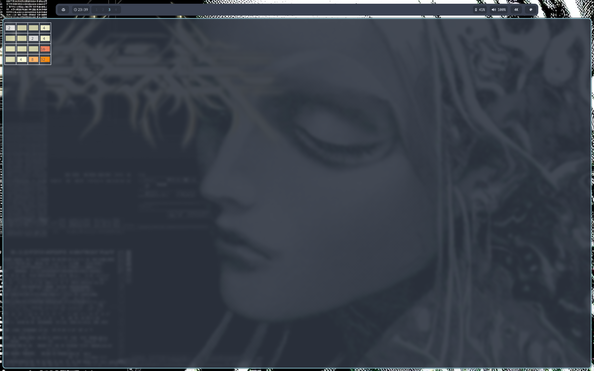

# 2048 for the Linux terminal



## to compile:
```
Install g++ with your favorite package manager, for example; sudo apt install g++

g++ main.cpp

Optional; g++ main.cpp -o outputFileName
```

Filepaths in 2048source.cpp need to be changed if you plan on moving the compiled file outside of the directory it is in but it is ready to compile straight out of clone.

Main will compile but throw error if text files are removed.

3nd edition of 2048 in the linux shell, adds better grid borders.
