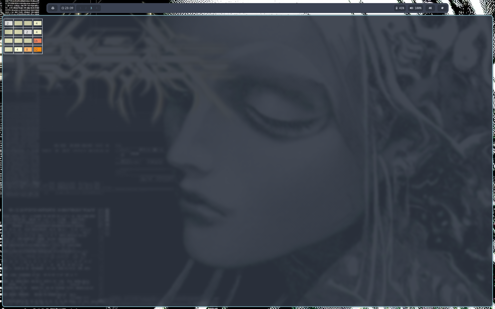

# 2048 for the Linux terminal



## AUR install:
```
yay -S 2048shell
```

## to build:
```
Install g++ and make with your favorite package manager, for example; sudo apt install g++ make

in root directory;

    make

The compiled binary will be placed in the build/ directory.
To clean build artifacts:

    make clean
```

## portable build (runs inside build/):
```
    make portable
```
Builds build/2048shell-portable, which resolves every data file next to the
binary instead of under /usr. The target also drops copywriteNotice.txt, LICENSE
and a fresh leaderBoard.ini into build/ (an existing leaderBoard.ini is kept), so
the game runs with nothing installed system-wide:

    ./build/2048shell-portable

It works from any working directory, and its scores stay in build/leaderBoard.ini
rather than ~/.local/share/2048shell/.

Filepaths in 2048source.cpp need to be changed if you plan on moving the compiled file outside of the directory it is in but it is ready to compile straight out of clone.

Main will compile but throw error if text files are removed.

3nd edition of 2048 in the linux shell, adds better grid borders.

## Credits:

- inih [benhoyt](https://github.com/benhoyt/inih) (New BSD license)
